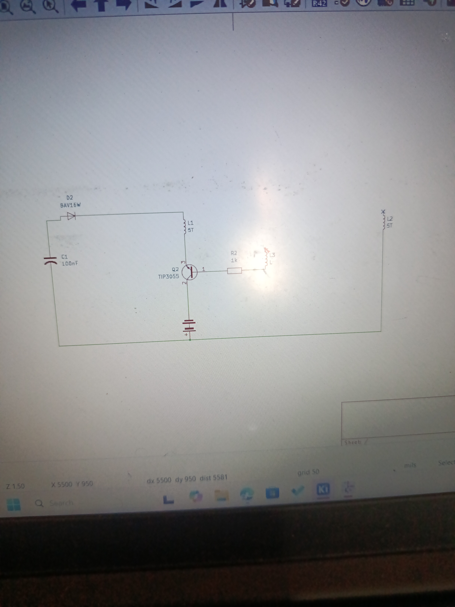
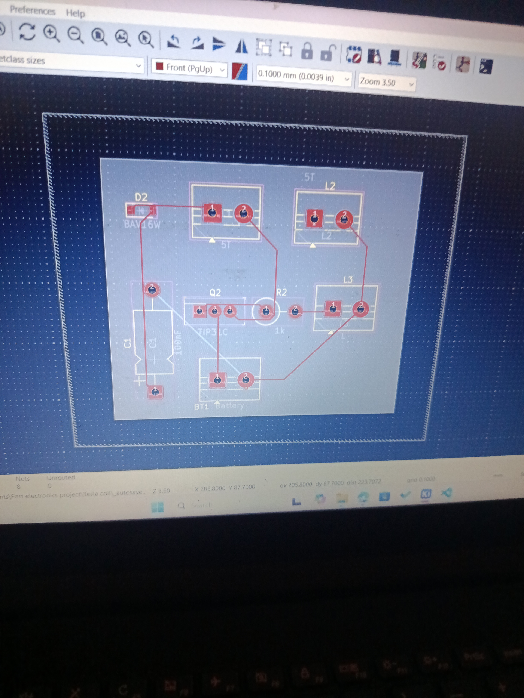
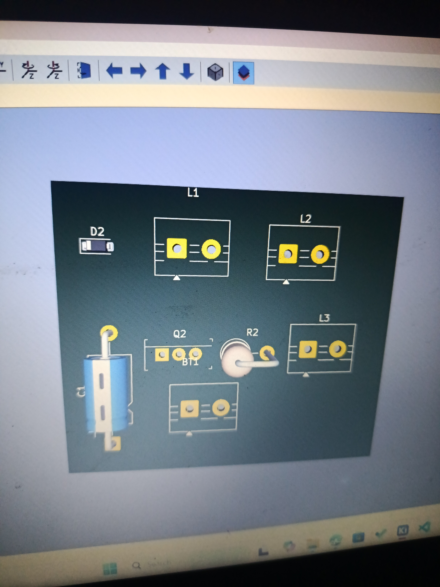

June 24
This was my fist KiCAD project outside the tutorials i have been following. 
I read some articles and watched videos on a Tesla coil enough to feel like i could make it and i saw this diagram and decided to use it to make the schematic.
This was my first attempt

This was the second attempt right after i realised that the two coils should not be stacked on themselves and kept seperate

I knew this was wrong and i was really confused about the switch particularly, was it supposed to be a custom part?, was the switch push correct? and what model
of transistor would be inappropriate?; these are all questions i had.

June 27
This was a great attempt (at the time), i was trying to make a spark gap and i added an LED cause i saw a lot of videos of people waving LEDs at the top of their Tesla coils

This was the second iteration, (albeit more clearer). I really cant say why i added a lot of the stuff here like the AC and others, i just kept reviewing diagrams online and thought it would be a nice addition
.png)

June 29
I finally concluded on my Schematic. I decided to use a feedback coil instead of the spark gap i had been trying to implement. I also decided to remove the LED and AC and just stick with the capacitor and stuff, so yeah, now i have 3 coils. I also replaced the global label with a no connection label because it kept popping up in my Electric Rules Checker and i didnt want any errors
.png)
I did one more iteration and viola!. The real schematic is definetly more clearer.

july 2
I didnt quite record this part, but i spent the next few days doing footprints assignment. I used mouser Electronics for this and i updated my kicad library cause it didnt have anything there, so this day i just finalised everything, i was a bit confused about the inductors(coils) not having a footprint, so i just replaced it with a 2-pin screw terminal, because when i think about it, a copper/magnetic wire isnt really an electric part i guess, same for the battery, i wanted the battery to be external so i also replaced it with a two pin screw terminal. I dont know if that works or that makes sense but its what i did.

July 4
This was a really exciting day cause i did the PCB design and generated the gerber files. By the way, the formatting i used for the gerber files are for JPCLB not PCB way (did this under the guidance of a tutorial). This was really fun to do. I am really proud of it and i was able to not cross any Design Rules

The two pin terminal as you can see where intended for the external parts i was going to list on the BOM.

July 5
This was a really pivotal point for me. I was gathering everything for submission when i realised that indeed a Tesla coil wouldnt really need a PCB because getting it manufactured and assembled by a PCB company would cost more than just soldering everything myself. This meant i had to make a lot of changes to the BOM and the PCB felt pretty useless. I still included it cause i am really proud of it and just because, but the BOM is under the fact that i am just using my Schematics. I really tried to cut cost here as instructed, there were unfortunately not a lot of things that went individually and lot of stuff came in pieces. I didnt include the resistor or a hook wire as i already have a resistor and some jumper wires that i think would do just fine, It rounded off to estimatedly $20. Overall really excited to see this come to life!

