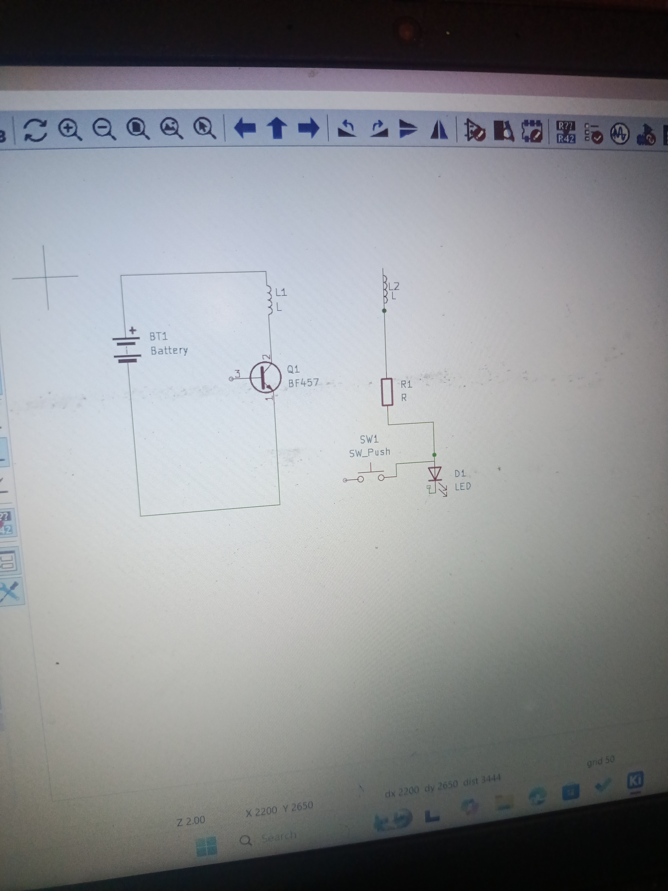
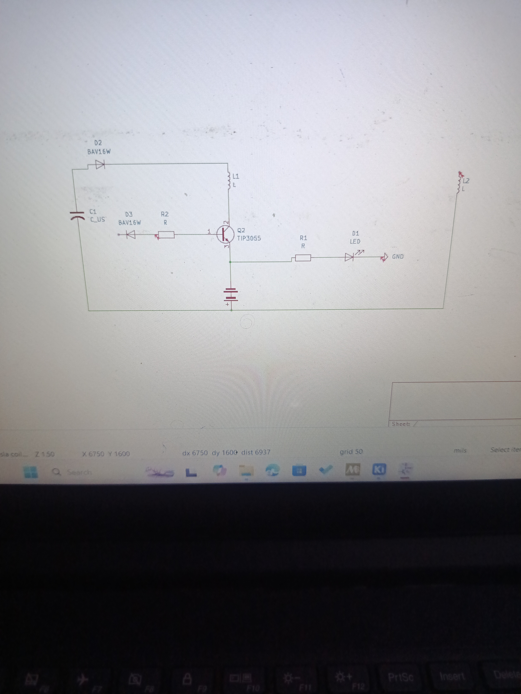

June 24
This was my fist KiCAD project outside the tutorials i have been following. 
I read some articles and watched videos on a Tesla coil enough to feel like i could make it and i saw this diagram and decided to use it to make the schematic.
This was my first attempt

This was the second attempt right after i realised that the two coils should not be stacked on themselves and kept seperate

I knew this was wrong and i was really confused about the switch particularly, was it supposed to be a custom part?, was the switch push correct? and what model
of transistor would be inappropriate?; these are all questions i had.

June 27
This was a great attempt (at the time), i was trying to make a spark gap and i added an LED cause i saw a lot of videos of people waving LEDs at the top of their Tesla coils

This was the second iteration, (albeit more clearer). I really cant say why i added a lot of the stuff here like the AC and others, i just kept reviewing diagrams online and thought it would be a nice addition
.png)

June 29
I finally concluded on my Schematic. I decided to use a feedback coil instead of the spark gap i had been trying to implement. I also decided to remove the LED and AC and just stick with the capacitor and stuff, so yeah, now i have 3 coils. I also replaced the global label with a no connection label because it kept popping up in my Electric Rules Checker and i didnt want any errors
.png)
I did one more iteration and viola!. The real schematic is definetly more clearer.

