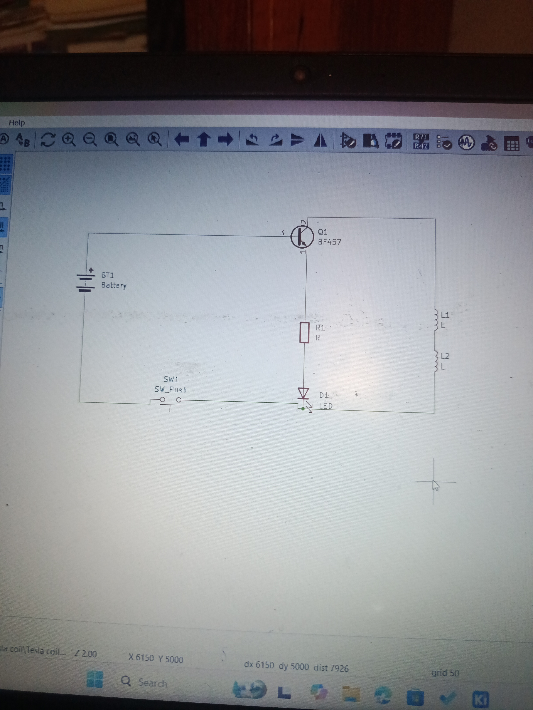

June 24
This was my fist KiCAD project outside the tutorials i have been following. 
I read some articles and watched videos on a Tesla coil enough to feel like i could make it and i saw this diagram and decided to use it to make the schematic.
This was my first attempt

This was the second attempt righ after i realised that the two coils should not be stacked on themselves and kept seperate

